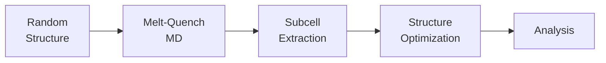

# Workflow Overview

The amorphous-to-crystalline (a2c) workflow predicts crystalline structures that emerge from amorphous precursors.

## Workflow Diagram

## Five Stages

### 1. Initial Structure Generation

Generate a random atomic configuration with desired composition.

**Function**: `random_packed_structure()`

**Purpose**: Create physically reasonable starting point with no severe atomic overlaps

**Key parameters**:
- `composition`: Chemical formula (e.g., "Si64")
- `cell`: 3×3 unit cell matrix (Å)
- `auto_diameter`: Auto-calculate atomic radii
- `seed`: Random seed for reproducibility

---

### 2. Melt-Quench Molecular Dynamics

Create amorphous structure through thermal cycling.

**Function**: `melt_quench_md()`

**Three phases**:

1. **High-T Equilibration**: Melt the structure
2. **Linear Cooling**: Quench to trap amorphous state
3. **Low-T Equilibration**: Relax at target temperature

**Key parameters**:
- `T_high`: Melting temperature (typically 1.5-2x melting point)
- `T_low`: Target temperature (e.g., 300K)
- `equi_steps`, `cool_steps`, `final_steps`: Duration of each phase
- `time_step`: Integration timestep (fs)
- `friction`: Langevin thermostat friction

!!! tip "Temperature Selection"
    Choose T_high above the material's melting point to ensure complete melting

---

### 3. Subcell Extraction

Divide amorphous structure into overlapping regions.

**Function**: `extract_crystallizable_subcells()`

**Method**: Regular grid in fractional coordinates

**Key parameters**:
- `d_frac`: Grid spacing (0.2 = 20% of cell)
- `n_min`, `n_max`: Atom count range (e.g., 2-8)
- `cubic_only`: Restrict to cubic subcells
- `allowed_atom_counts`: Specific atom counts

!!! warning "Performance"
    Smaller `d_frac` creates more subcells. Use 0.2-0.33 for good balance.

---

### 4. Structure Optimization

Relax each subcell to find stable crystal structures.

**Function**: `relax_unit_cell()`

**Method**: FIRE algorithm with FrechetCellFilter

**Optimizes**:
- Atomic positions
- Cell shape and volume

**Key parameters**:
- `max_iter`: Maximum optimization steps (e.g., 200)
- `fmax`: Force convergence criterion (eV/Å)

---

### 5. Validation and Analysis

Identify and rank stable structures.

**Validation**: `valid_subcell()`
- Energy decreased during optimization
- Formation energy physically reasonable
- No atomic fusion (atoms too close)
- Forces converged

**Analysis**: Using pymatgen
- Determine space group with `SpacegroupAnalyzer`
- Compare to reference structures with `StructureMatcher`
- Rank by energy per atom

---

## Complete Example

Full working implementation: [`example/Si64.py`](../examples/index.md)

---

## Performance

| Stage | Bottleneck | Solution |
|-------|-----------|----------|
| Random packing | Overlap removal | Increase diameter |
| Melt-quench | MD steps | Reduce steps for testing |
| Subcell extraction | Too many subcells | Increase d_frac |
| Optimization | Force calculations | Use GPU, parallelize |

---

## See Also

- [Examples](../examples/index.md)
- [API Reference](../api/runner.md)
- [Quick Start](../getting-started/quickstart.md)
